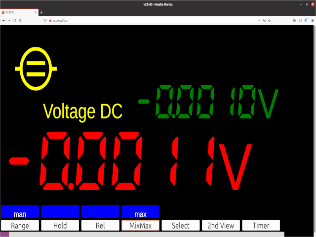

# VC8145 ESP32 Web-GUI
VC8145 ESP32 Web-GUI

## Optional backlight
Solder backligth always on

##  Optional 3d print 
3d print esp32 dev board mount dir /mount

## Prerequisites
ESP32 Dev Board
Flash ESP with Micropython
### 5 Pin connector 
Connection Vin Gnd RX (esp32 pin 12)  TX (esp32 pin 13)  JST XH2.54 5 pin

### Desoldering
Desolder Optocopplers from pcb and add jumpwire

### Python code copy to board
Copy Micropyhon Webserver Websocket from /pyboard with rshell

